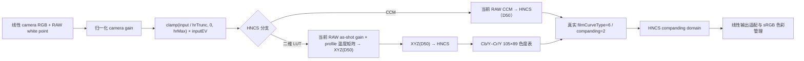

# HNCS RAW 渲染引擎

## 结论与数据边界

HNCS 二维色度表不是通用 LUT，也不能脱离对应传感器使用。运行时数据只允许来自三类来源：

1. Phocus `assets/Colormaps/LUTTable*.xml` 中的实测表、矩阵、色温和 neutral vector；
2. Phocus 程序/GLSL 中可定位的公式与常量；
3. 当前 RAW 的 Camera2、DNG SDK 或 LibRaw 元数据。

原先的 `neutral.hncs.json`、3×3 identity 色度表、经验 film curve、R/B gain 比值色温插值、
灰轴经验阈值、低照度经验阈值以及缺失 profile 时的静默回退均已删除。二维 LUT 分支缺少
任一必需数据时直接拒绝渲染，不切换为 CCM 或 Adobe Curve。

## 原始资源审计

原始目录：

```text
C:/Users/Hinnka/Desktop/phocus/app/src/main/assets/Colormaps
```

目录包含 26 个 XML。转换器接受 21 个满足全部约束的文件：

- 有 `CbS/CbE/CrS/CrE/DivFactor`；
- 网格固定为 105×89，每个表恰好有 `105×89×2 = 18,690` 个值；
- 同时有 Standard 与 Reproduction；
- 每个意图至少有 TS/Flash 两个色温表；
- 至少有两个相机矩阵锚点和两个 neutral vector 锚点。

不进入运行时的 5 个文件：

| 文件 | 原因 |
|---|---|
| `LUTTable31MPRepro.xml` | 不属于当前有边界、多意图、多色温格式 |
| `LUTTable39MPRepr.xml` | 同上 |
| `LUTTableIxpressNew.xml` | 同上 |
| `LUTTableIxpressRepr.xml` | 同上 |
| `LUTTableleica.xml` | `LUTTableTSStd` 只有 18,689 个值，源数据少 1 个值 |

不会为 `LUTTableleica.xml` 补值，也不保留旧格式解析分支。完整 profile 清单、源文件长度和
SHA-256 位于
[`app/src/main/assets/hncs/manifest.json`](../app/src/main/assets/hncs/manifest.json)。

转换命令：

```powershell
uv run python scripts/convert_phocus_hncs.py `
  "C:\Users\Hinnka\Desktop\phocus\app\src\main\assets\Colormaps" `
  app/src/main/assets/hncs --verify
```

`--verify` 会重新读取原 XML，检查源 SHA-256、网格与色温字段，并逐个以 float32 字节比较
所有表、解密矩阵、解密 neutral gain 和 DNG matrix；同时确认 payload 无空洞、重叠或未引用数据。

## 可追溯二进制格式

每个 `.hncs` 文件的布局为：

```text
8 bytes  magic "HNCSMAP1"
4 bytes  little-endian JSON header length
N bytes  UTF-8 JSON header
M bytes  zlib-compressed little-endian float32 payload
```

header 保存：

- `schemaVersion=2`；运行时不保留 schema v1 兼容解析；
- 原 XML 文件名、长度、SHA-256 和 Phocus `Version`；
- 网格边界、尺寸与 `DivFactor`；
- 每张表的原 key、意图、色温 key、色温、payload offset/count；
- 每个矩阵和 neutral vector 的原 key、色温及 payload offset/count；
- 解压 payload 的长度、float 数量和 SHA-256。

Phocus 的 `m*` 矩阵与 `v*` neutral gain 数组都按 `CXMLLut::DecryptArray` 的真实变换解出：

```text
decoded = encrypted × 0.5 + 1.0
```

运行时再次校验 magic、schema、manifest/header 的源文件与源哈希、payload 长度和 payload
SHA-256，之后才允许构建渲染计划。

## HNCS 工作色彩空间

`CRawColorCorrection::GetColorSpaceChangeMatrix` 中恢复的 HNCS RGB→XYZ(D50) 矩阵为：

```text
[ 0.79767  0.13519  0.03134 ]
[ 0.28804  0.71188  0.00009 ]
[ 0.00000  0.00000  0.82491 ]
```

由此得到的色度坐标与项目中的 `ColorSpace.HNCS` 一致：

| 项 | x | y |
|---|---:|---:|
| R | 0.734699 | 0.265301 |
| G | 0.159597 | 0.840403 |
| B | 0.036598 | 0.000105 |
| White | 0.345704 | 0.358540 |

HNCS 与 ProPhoto 数值接近，但两者是不同的处理契约，代码中保留独立枚举，避免相机矩阵或
二维表被误用到其他引擎。

## 两条相机色彩分支



### CCM 分支

`HncsCcm` 始终使用当前 RAW 的 ColorMatrix/ForwardMatrix/CameraNeutral，通过现有 DNG SDK
色彩规格求解 camera→XYZ(D50)，再变换到 HNCS。它不读取 Phocus 相机 profile，因此可用于
非 Hasselblad RAW；它得到的是 HNCS tone rendering，并不等同于某台 Hasselblad 的 HNCS
相机色彩。

### 二维 LUT 分支

`HncsLut` 必须显式选择与传感器对应的 profile。运行时不会按文件名、相机 make/model 或首个
asset 猜测 profile。Phocus 原生选择键不是机型字符串，而是
`eCCDTypes + eIRFilterType → uColorProfile → LUTTable*.xml`；因此 UI 中的机型名称只是帮助
人选择，不能取代 RAW 中的传感器与 IR-filter revision 元数据。相同机型族可能对应多个
profile，同一个 profile 也可能由多台机型共享。

`libcrosssdk.so` 的 `CRawColorParams::GetCPID`、`CXMLLut::GetFileName`、
`CBodyAndBack::CameraBackModelString` 和 `CBodyAndBack::WebDeviceType` 可恢复以下对应关系。
方括号保留 Phocus 内部 profile 名，用于区分同机型族的不同滤镜/传感器标定版本：

| Colormap profile | 原生 color-profile ID / CCD type | UI displayName |
|---|---|---|
| `LUTTable100MP` | `0x0511` / `0x11` | Hasselblad H6D/A6D 100c [100MP] |
| `LUTTable100MP2` | `0x0514`, `0x0614`, `0x0714` / `0x14` | Hasselblad X2D 100C |
| `LUTTable100MP3` | `0x0615`, `0x0616` / `0x15`, `0x16` | Hasselblad CFV 100C / X2D II 100C |
| `LUTTable20MP1Inch` | `0x0013` / `0x13` | Hasselblad L1D-20c |
| `LUTTable22MPC` | `0x0404` / `0x04` | Hasselblad CF/CFH/CFV/503CWD [22MPC] |
| `LUTTable31MP`, `LUTTable31MPC` | `0x0008`, `0x0408` / `0x08` | Hasselblad H3D/H3DII/H4D-31 [profile revision] |
| `LUTTable39MP`, `LUTTable39MPC` | `0x0009`, `0x0409` / `0x09` | Hasselblad H2D/H3D/H3DII-39 [profile revision] |
| `LUTTable40MP5`, `LUTTable40MPC` | `0x050d`, `0x040d` / `0x0d` | Hasselblad H3DII/H4D/H5D-40 [profile revision] |
| `LUTTable50MP5`, `LUTTable50MPC` | `0x050b`, `0x040b` / `0x0b` | Hasselblad H3DII/H4D/H5D-50 [profile revision] |
| `LUTTable51MP5` | `0x050f` / `0x0f` | Hasselblad H5D/H6D/A6D/X1D 50c [51MP5] |
| `LUTTable51MPmk2` | `0x690f` / `0x0f` | Hasselblad CFV II / X1D II 50C |
| `LUTTable60MP5`, `LUTTable60MPC` | `0x050c`, `0x040c` / `0x0c` | Hasselblad H3DII/H4D/H5D-60 [profile revision] |
| `LutTable60MP52` | `0x040e`, `0x050e` / `0x0e` | Hasselblad H3DII/H4D/H5D-60 [60MP52] |
| `LutTable80MP52` | `0x0510` / `0x10` | Phocus 内部传感器 profile；原库没有可证明的公开机型名 |
| `LUTTableIxpress` | `0x0004` / `0x04` | Hasselblad Ixpress 96/384/72/132C/528C |
| `LUTTableTZ` | `0x0012` / `0x12` | Hasselblad True Zoom |

manifest 和每个 `.hncs` header 同时保存 `cameraModels`、`colorProfileIds`、`ccdTypes` 与
`selectionKey`。`LutTable80MP52` 不强行编造机型名；其他共享 profile 的 `cameraModels`
记录代表性、可由原生型号函数和产品组合确认的机型，而不是宣称穷尽所有硬件修订。

该分支同时使用同一 profile 的：

- 插值后的 `vlt/vt/vf/vh` profile 参考 neutral gain，用于保留/审计 profile 的 CCT 标定白点；
- 插值后的白平衡 camera RGB→XYZ(D50) 矩阵；
- 插值后的 Standard 或 Reproduction Cb/Y–Cr/Y 表；
- 固定 XYZ(D50)→HNCS 矩阵。

XML 中 `mlt/mt/mf/mh` 的行和对应 D50 XYZ 白点，说明它们不是 camera→HNCS 矩阵。
它们消费的是已白平衡的 camera RGB。`vlt/vt/vf/vh` 不是明文 gain；
`CXMLLut::DecodeFrom` 对三元素数组执行与矩阵相同的 `encrypted × 0.5 + 1.0`。原始
`CRawColorParams::GetXYZ2RawRGBNeutralizedMatrix` 随后逐列乘对应 gain，再对结果求逆。

PhotonCamera 的 RCD/VGN 对外输出刻意撤销了仅供插值计算的白平衡，所以进入线性色彩 pass 的是
未白平衡 camera RGB。`v_profile(CCT)` 只描述 profile 在该 CCT 上的参考白点，不能替换当前
RAW 的 `AsShotNeutral`：同一个 CCT 可以有不同的绿—洋红 Tint。二维 LUT 分支必须把当前
RAW 的实际 gain 合并回矩阵：

```text
g_active             = inverse(AsShotNeutral)
rawCameraToXyzD50    = M_profile(CCT) × diag(g_active)
rawCameraToHncs    = inverse(HNCS_RGB_TO_XYZ_D50) × rawCameraToXyzD50
```

这个契约可直接用中性不变量验证。当前 RAW 的中性向量为 `1/g_active`，因此：

```text
rawCameraToHncs × (1/g_active)
= inverse(HNCS_RGB_TO_XYZ_D50) × M_profile × [1,1,1]
≈ [1,1,1]
```

矩阵与 LUT 仍按 CCT 插值，但 render-plan 缓存键还必须包含 `g_active`。否则两张 Kelvin
相同、Tint 不同的 RAW 会复用错误的复合矩阵。

此前 schema v1 把加密的 `v*` 原值写入资产（G 通道因此为 0），运行时又未把 gain 合并进矩阵，
未白平衡 RAW 会以 G 通道占优进入 LUT，表现为整幅绿色。schema v1 资产及解析语义已删除，
所有 profile 已由原 XML 重生为 schema v2。

矩阵与 LUT 是一份相机标定的两个组成部分，不能把 Phocus 二维表叠加在任意第三方 CCM 上。

## 实测色温

LUT 插值只接受由当前 RAW 白点求出的 CCT，不使用 R/B gain 比值猜测：

- Camera2 RAW：由 `SENSOR_COLOR_TRANSFORM*`、`SENSOR_FORWARD_MATRIX*`、
  `SENSOR_REFERENCE_ILLUMINANT*` 与 `COLOR_CORRECTION_GAINS` 按 DNG color-spec 求白点 xy；
- DNG：native DNG color-spec 路径直接返回求解得到的 `sdkWhiteXy`；
- 非 DNG RAW：LibRaw `cam_xyz` 与当前 CameraNeutral 求白点 xy；
- xy→CCT：使用项目中与 DNG SDK 语义一致的 Robertson reciprocal-temperature 表。

无法从真实矩阵与 CameraNeutral 求得 xy 时，CCT 为 `null`，二维 LUT 分支拒绝渲染。代码不会
用 D50、5000 K 或白平衡 gain 比值补位。

## 色温插值

`CXMLLut::CalculateLUT` 的规则：

- Version 3：CCT clamp 到 2000–10000 K；低段在 TS@`tt` 与 Flash@`tf` 间线性插值，高段在
  Flash@`tf` 与 HT@`th` 间线性插值；
- 其他受支持版本：CCT clamp 到 2000–6200 K，在 TS@`tt` 与 Flash@`tf` 间线性插值。

矩阵插值：

- Version 3：2000–10000 K，按实际存在的 `mlt@tlt → mt@tt → mf@tf → mh@th` 分段线性插值；
- 其他版本：2000–8000 K，按实际存在的矩阵锚点分段线性插值。

精确落在锚点时直接复制原数组；区间外复制端点。Standard/Reproduction 只在同一意图的表内
插值，不交叉混合。Phocus 的 `CXMLLut::CalculateLUT(int, bool)` 与
`CalculateMatrix(int)` 接收整数 Kelvin，因此运行时先把实测 CCT 截为整数，再做 clamp 和插值。

## Cb/Y–Cr/Y 数值域

HNCS luma 来自工作空间矩阵第二行：

```text
Kr = 0.28804
Kg = 0.71188
Kb = 0.00009

Y  = Kr·R + Kg·G + Kb·B
Cb = (B-Y) / (2·(1-Kb))
Cr = (R-Y) / (2·(1-Kr))
```

Phocus 表保存的是网格单位的输出 Cb/Cr，不是归一化色度。查询与重建：

```text
position = DivFactor × [Cb/Y, Cr/Y] - [CbS, CrS]
mapped   = bilinear(table, clamp(position, 0, [width-1, height-1]))
Cb'Cr'   = mapped × Y / DivFactor
RGB'     = M_ycc_to_rgb × [Y, Cb', Cr']
```

shader 使用四次 `texelFetch` 手工双线性插值，X 轴为 Cb、Y 轴为 Cr。`DivFactor` 在查询时
相乘、重建时相除；少任一侧都会产生 32 倍色度尺度错误。

Phocus 完整支持路径的 `SetGrayThresholds` 为 0/0，`CalculateDesatValues` 为
threshold=2、a=0、b=0、c=1，因此低照度权重恒为 1。原 shader 在灰轴 0/0 区间可能产生
非有限数；本实现对这个已知零宽区间显式定义权重为 1，既不加入经验阈值，也不依赖不同 GLES
驱动对 NaN 的处理。

## 原始 filter graph 与当前可执行路径

Phocus `CCameraImage::AddHNCSFilters` 的原始顺序已经确认：

```text
ColorCorrectAll
→ FilmCurve
→ [EffectiveFilmCurve 为 2 或 4时] HighlightStrength
→ [新版 correction 且 RAW 支持时] Gamma(Hasselblad 或 LStar)
→ Gradation
→ [启用选择性色彩时] SelectiveColor
```

当前 HNCS 渲染计划有真实数据可执行的路径为：

```text
ColorCorrectAll
→ FilmCurve(标准 C / Reproduction E)
→ 跳过 CGammaFilter（Phocus 默认 correction version=2、gamma flag=false）
→ HNCS companding 解码
→ HNCS 到线性 sRGB
```

Phocus 自动插入 HighlightStrength 的条件仍是 `EffectiveFilmCurve=2/4`，这与
`CGradationManager` 构造参数中的 `filmCurveType=7` 不是同一个判断。由于数值 2/4 的公开
枚举名称尚未恢复，当前应用不接入 HighlightStrength，也不根据 B/C/E 曲线名称臆测它的启用
状态。

Gradation 在原始图中始终存在，SelectiveColor 按用户设置创建；但二者的非恒等 65,536 点表
来自 Phocus `CImageCorrection`/用户编辑状态，不在相机 Colormap XML 中。PhotonCamera 没有
这些真实表时不会把自己的通用滑杆、经验曲线或 identity 纹理伪装成 Phocus 数据。默认
Brightness/Contrast 为 0，`EffectiveGamma=1`，所以这时 `CGradationFilter` 的总表是恒等
映射；不绘制一个 identity pass 与原图数值等价。

### Film Curve

`CGradationManager` 根据 `filmCurveType` 与 `companding` 从五张静态表 A–E 选择：

```text
type=0,    companding=1 → A
type=1..6, companding=1 → B
type=0..6, companding=2 → C
type=7,    companding=1 → D
type=7,    companding=2 → E
```

因此 type 7 本身不等于 E；还必须是 `companding=2`，`type=7/companding=1` 会得到 D。
应用按界面语义接入两张原表：

| 界面选项 | 原表 | 构造参数 | float 表 FNV-1a64 | asset SHA-256 |
|---|---|---|---|---|
| 标准 | C | type=6, companding=2 | `a7fda12f9d03aa3f` | `0b26cfdeb578ca21eee5e55e95c4f49ca43ab333e2cea5a011049c07bee4b531` |
| Reproduction | E | type=7, companding=2 | `aef781b4a11cdc4a` | `a5f1b9e3e7dc5f37a71840906e3edf6467e64d11450e68d85c436acf84504bd8` |

两张 65,536 点表都由原始 `libcrosssdk.so`（SHA-256
`4320cacc91faf0ac16b0653760b86f604303162d43c1cad5fe182b73b9eede6b`）
运行时直接导出，而不是用近似公式重建。缺少 maker FilmCurve tag 时，
`CRawImageFile::GetFilmCurveType` 与 `CRawImageFileData::GetFilmCurveType` 返回 6；
原先默认 HNCS 路径的 `companding=2` 对应上表中的标准 C。

`CGradationManager::SetFilmCurve` 与构造函数都只是从已经初始化的同一组静态表选择并复制目标
表，不存在漏掉的二次曲线计算。shader 按 Phocus 行为使用
`floor(clamp(input/gain × 65536, 0, 65535))` 最近点读取，正常路径 `gain=1`，不对输出再次乘
gain，也不做曲线尾部外推。

### 条件 Gamma

`CGammaFilter` 恢复的常量：

```text
GammaHasselbladRgb  = 2.19921875
HDRMaxGain          = 49.261085510253906
HasselbladHdrRgbLimit = 5.882924556732178

encoded = pow(linear × HDRMaxGain, 1 / GammaHasselbladRgb)
          / HasselbladHdrRgbLimit
```

这些常量并不表示 `CGammaFilter` 必经。`CCameraImage::AddHNCSFilters` 的真实插入条件是：

```text
CImageCorrection.storedVersion >= 4
&& CImageCorrection.gammaStageFlag
&& sRawDescription.supportsGammaStage
```

`CImageCorrection::SetDefaultValues` 写入 `storedVersion=2` 并清除 gamma flag；因此没有导入
Phocus correction 元数据的普通 RAW 必须跳过 `CGammaFilter`。此前无条件执行它把 FilmCurve
后的 P50 从 `0.357` 再抬到 `0.626`，形成一次原图不存在的重复 companding。

FilmCurve companding 2 的输出随后按 HNCS source transfer 解码，再做 HNCS→线性 sRGB 矩阵与
标准 sRGB 编码。若以后接入真实的新版 `CImageCorrection`，才可按上述三个真实字段启用
Hasselblad/LStar Gamma 分支，不能仅凭相机品牌或 UI 选项推断。

### 仍不可执行的原始分支

- `EffectiveFilmCurve=2/4` 的公开名称仍未恢复，因此不能自动把该条件映射到 B/C/E；
- HighlightStrength 不接入当前渲染计划，避免脱离 `EffectiveFilmCurve=2/4` 条件单独运行；
- LStar Gamma 的选择字段已定位，但当前 HNCS 默认计划不满足 Gamma filter 插入条件；
- Gradation/SelectiveColor 的 shader 已审计，缺少的是真实 `CImageCorrection` 用户表，不是
  像素公式。

因此 UI 只暴露已有真实表驱动的选择。以后启用其他分支时，必须接入对应的真实
65,536 点或 128×128 表及其宿主状态，不能用经验曲线替代。

## “自然”和“人像”在哪里

原始 Phocus Colormap 资源与 native HNCS 图中可确认的相机色彩 render intent 只有
`Standard` 和 `Reproduction`。没有第三组名为 `Natural` 或 `Portrait` 的二维表，也没有对应
的 HNCS 枚举或 filter 分支。

- “Natural”是 Hasselblad Natural Colour Solution 名称中的描述词，不是一个与 Standard 并列
  的 profile；
- “Portrait”在已检查的 Phocus 资源中用于画面方向/题材描述，不是 HNCS render intent；
- Phocus 的 Response 工具还有 `Reproduction Low Gain` 与 `Negative`，它们属于响应/影调
  选择，不能伪装成相机二维色度表。

因此 UI 只提供有真实 XML 数据的 Standard/Reproduction。加入“自然/人像”会生成不存在的模式，
违背本引擎的真实数据约束。

## 严格失败条件

以下任一条件都会使 `HncsLut` 返回失败：

- 未显式选择 profile；
- profile id 不在 manifest；
- RAW 白点 xy/CCT 无法由真实元数据求得；
- manifest/header 源文件或 SHA-256 不一致；
- payload 长度或 SHA-256 不一致；
- grid 不是 105×89，表长度不等于 18,690；
- 所选意图缺少至少两个温度表；
- 矩阵或 neutral vector 少于两个锚点；
- 插值后出现非有限数据，或 neutral gain 非正；
- LUT 纹理或 film curve 纹理上传失败。

没有 LUT→CCM、HNCS→Adobe Curve、首 profile 或默认 5000 K 回退。

## 相机域截断与 headroom

原始 `ColorCorrectAll` shader 在输入矩阵前执行：

```text
source = clamp(raw × normalizedCameraGain / hrTrunc, 0, hrMax) × inputEV
```

`CColorCorrectAllFilter::FilterResultGpu` 的 uniform 映射已经逐项确认：

```text
filter + 0x188 → uInputEV
filter + 0x190 → uHrTrunc
filter + 0x194 → uHrMax
```

`ColorCorrectionAllFilter::GetHrEV` 使用当前 as-shot RGB gain、source ISO/sensitivity gain 和
image-correction EV；`UpdateParameters` 再写入上述三个字段。旧版与新版
`CImageCorrection` 会把 camera gain/source exposure 分配到 gain、`inputEV` 和
`CRawColorCorrection` linearization 的不同位置，不能把某一版本的对象内存值直接套到当前
管线。没有导入 Phocus 局部曝光或镜头 EV correction 时，能够确定的默认截断因子为：

```text
hrTrunc = 1
hrMax   = 1
```

PhotonCamera 把跨版本但数值等价的 gain/exposure 项规范到显式参数：

```text
normalizedCameraGain = cameraGain / max(cameraGain)
inputEV = sourceExposureGain × max(cameraGain)
```

PhotonCamera 进入该阶段前已经按 `(raw - black) / (white - black)` 完成 RAW 白电平归一化，
所以 Phocus source ISO/sensitivity normalization 在本域的等价量就是 DNG
`2^BaselineExposure`，不能再额外乘一次 ISO 或 `PostRawSensitivityBoost`。运行时使用：

```text
g = 当前 RAW as-shot RGB gain         // HNCS 2D LUT 与 CCM

gNormalized = g / max(g)
inputEV     = 2^BaselineExposure × max(g)
Mbase       = Mcomposite × diag(1 / g)

camera = clamp(raw × gNormalized, 0, 1) × inputEV
hncs   = Mbase × camera
```

未触发截断时，上式严格等于既有
`Mcomposite × raw × 2^BaselineExposure`；触发截断时则与 Phocus 一样在相机 gain 之后、
输入矩阵之前截断。`BaselineExposure` 和测光候选 EV 由 `inputEV` 消费，线性 pass 的通用
`uExposureGain` 在 HNCS 路径保持 1，因此不会重复曝光。用户编辑 EV 仍可在矩阵后、2D LUT 前
作为线性标量应用，与在输入矩阵前相乘数值等价。

这里的 `[0,1]` 只属于相机域。camera→HNCS 矩阵产生的合法负值和 overrange 不再二次 clamp，
以免破坏矩阵与后续 Cb/Y–Cr/Y 色度表的输入。

## 非 Hasselblad RAW 的相机专属 LUT

要为第三方相机生成同域 LUT，必须重新测量，而不是复用 Phocus 表：

1. 在多个已测光谱照明下拍摄线性 RAW、灰阶、标准色卡与扩展高饱和样本；
2. 用该相机真实 ColorMatrix/ForwardMatrix 建立 camera→XYZ(D50)→HNCS 的中性色度基准；
3. 以独立光谱/色度目标求每个样本的目标 HNCS RGB；
4. 在相同的 `Cb/Y–Cr/Y` 定义和固定网格中拟合输入位置到目标 Cb/Cr 网格值；
5. 每个光源分别保存真实 CCT、camera matrix、neutral vector、Standard/Reproduction 表；
6. 用未参与拟合的光源、肤色、曝光与高饱和样本验证 ΔE、中性轴、跨光源连续性和 gamut；
7. 生成资源时保存测量集版本、仪器、源 RAW 哈希、拟合器版本和验证报告。

只有 CCM 时可以使用 `HncsCcm`；没有上述重新测量数据时，不存在真实可用的“第三方相机
HNCS 二维 LUT”。

## GLES 约束

- 色度表和 film curve 使用 `RGBA16F sampler2D`，避免移动驱动的 `RG16F` 组合差异；
- 105×89 色度表使用 `GL_NEAREST`，shader 显式四点插值；
- 65,536 点 film curve 固定铺成 256×256，并使用整数 `texelFetch`；
- LUT 宽高由 CPU uniform 显式传入，不用 `textureSize/imageSize` 决定索引边界；
- sampler 不作为用户函数参数，纹理不绑定为 image，也不使用 `imageLoad/imageStore`。

相关兼容性记录见
[`docs/gles-driver-compatibility.md`](gles-driver-compatibility.md)。
