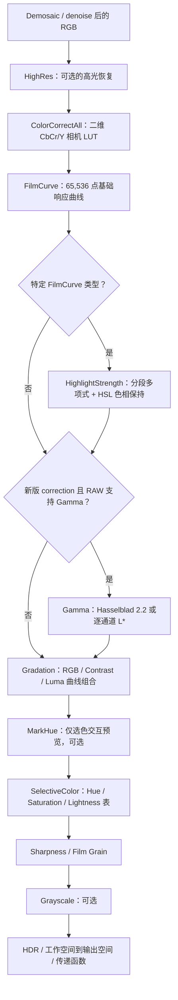

# Phocus RAW 渲染管线：Color / Tone 技术方案分析

> 分析对象：Android Phocus `libcrosssdk.so` 中静态恢复的 GLSL、ELF 导出符号、
> AArch64 调用序列，以及 `app/src/main/assets/Colormaps` 下的相机色彩资源。
> 本文记录的是互操作与算法研究结论，不代表厂商公开规格，也不构成对原代码的再授权。

## 技术结论

Phocus 的 color/tone 不是一个统一的 3D LUT，而是把不同性质的问题拆成了四层：

1. **相机表色层**：把 RGB 转为亮度与两条色度轴，以 `Cb/Y`、`Cr/Y` 查询相机和光源相关的
   二维色度 LUT；亮度 `Y` 原样保留。近中性色和低照度像素会降低 LUT 权重，避免噪声与白平衡
   误差被放大。
2. **基础调性层**：使用 65,536 点的一维 Film Curve，随后按 Film Curve 类型选择分段高光
   塑形；只有新版 correction 状态与 RAW capability 同时满足条件时，才追加 Hasselblad
   power gamma 或逐通道 CIE L* companding。
3. **用户创作层**：RGB/对比度/亮度曲线使用独立的 65,536 点 LUT；选择性色彩则把色相映射到
   三张 65,536 点的一维表，分别控制 Hue、Saturation、Lightness。两者都显式做色相保护。
4. **交付表色层**：最后才执行工作空间到目标空间的矩阵、白点适配和 Gamma/PQ 编码；预览路径
   另有固定矩阵的 SDR ICC pass。

主 HNCS GPU 路径在宿主函数 `CCameraImage::AddHNCSFilters`（ELF 地址 `0x324241c`）中的有效顺序为：



这条顺序非常关键：Gamma 是条件节点；它存在时 Film Curve/高光塑形在它之前，
Gradation/Selective Color 在它之后；它不存在时 Gradation 直接接 Film Curve。不能把全部
LUT 合并后任意换序。

## 证据范围与可信度

| 证据 | 能确定的内容 | 不能单独确定的内容 |
|---|---|---|
| 本目录 25 个 GLSL 文本及 `manifest.json` | 逐像素公式、纹理/UBO 接口、分支和裁剪 | 宿主实际传值、某个 shader 是否进入主图 |
| `libcrosssdk.so` 导出符号与反汇编 | filter 类型、主调用顺序、CPU 侧 LUT 创建函数 | 未导出函数的业务命名、运行时开关状态 |
| `assets/Colormaps/*.xml` | LUT 端点、维度、光源/模式资源组织 | 每台相机运行时最终选择和插值结果 |
| Java/UI 资源 | 用户可见的 Highlight、Saturation、Selective Color 等调整项 | native 字段偏移与 UI 参数的完整一一映射 |

本文把结论分为三档：

- **已确认**：shader 公式和宿主调用都能互相印证。
- **高可信推断**：资源尺寸、符号名和使用方式一致，但尚无运行时 GPU capture。
- **待验证**：只有孤立 shader 或未接入主调用图的实验实现支持。

## 两套渲染路径解释了同名 shader 并存

库中存在两代实现，不能按文件名大小写把它们当成等价副本。

| 路径 | 宿主入口 | 色彩校正 | Tone 组织 | 典型用途 |
|---|---|---|---|---|
| HNCS 主路径 | `CCameraImage::AddHNCSFilters` | `CColorCorrectAllFilter` + [`colorCorrectAll_0x3027dea.frag`](./colorCorrectAll_0x3027dea.frag) | 独立 `CFilmCurveFilter` →可选 Highlight→可选 Gamma→ Gradation | 完整 RAW 处理 |
| PostViewer RGB 路径 | `CCameraImage::AddPostViewerRGBFilters`，地址 `0x323f5a4` | 旧式 `CColorCorrectFilter` + [`color_correct_0x303b6ab.comp`](./color_correct_0x303b6ab.comp) | Highlight→ Gamma→ Gradation；Film/线性化的一部分由 ColorCorrection 资源承担 | 后置预览/已有 RGB 输入 |
| 轻量 OpenGL 包装层 | `ColorCorrectAllFilter`、`FilmCurveFilter`、`HighlightStrengthFilter` 等无 `C` 前缀类 | [`ColorCorrectAll_0x301a79e.frag`](./ColorCorrectAll_0x301a79e.frag) | 对应的大写 shader | 另一套直接纹理渲染接口；包含未闭合功能 |

主路径反汇编中的关键插入点依次为：`CColorCorrectAllFilter` `0x3242524`、
`CFilmCurveFilter` `0x32425e8`、条件性 `CHighlightStrengthFilter` `0x324285c`、
条件性 `CGammaFilter` `0x3242680`、`CGradationFilter` `0x324271c`、
`CSelectiveColorFilter` `0x3242934/0x32429e0`。两个 SelectiveColor 构造点属于互斥分支，
不是连续应用两次。

## 1. 相机表色：保亮度的二维色度映射

### 1.1 相机资源不是普通 3D LUT

以 `LUTTable100MP3.xml` 为例：

| 项 | 值 |
|---|---:|
| `CbS` / `CbE` | -20 / 84 |
| `CrS` / `CrE` | -32 / 56 |
| `DivFactor` | 32 |
| LUT 网格 | `(84 - (-20) + 1) × (56 - (-32) + 1) = 105 × 89` |
| 每张表的数据量 | `105 × 89 × 2 = 18,690` 个实数 |

每个网格点只有两个输出分量，正好对应校正后的 Cb/Cr。资源同时提供
`Flash/TS/HT × Std/Repro` 六张表，并保存 Flash、Tungsten、Low Tungsten 等温度、矩阵与
neutral vector。导出符号 `CXMLLut::CalculateLUT(int, bool)`、`CColorCorrection::SetupCC(...)`
和 `CreateCbCrLut(...)` 说明 CPU 会先按机型、色温与 Standard/Reproduction 模式得到本次渲染
使用的二维表，再上传 GPU。XML 中的原始表不是每像素直接做六表混合。

`Std` 与 `Repro` 的差别不仅是色彩风格。旧 compute shader 的 `uIsRepo` 会让 Reproduction
模式绕过低亮度去饱和逻辑，因此它更接近“保持测量色度”，Standard 则更主动抑制暗部色噪。
当前 HNCS 主 fragment 没有 `uIsRepo` uniform；主路径中的模式差异首先来自宿主上传的不同
实测 LUT。不能把旧 compute 路径的分支直接移植成主 fragment 的额外开关。

XML 的 `mlt/mt/mf/mh` 解密后行和为 D50 XYZ 白点，语义是白平衡后的 camera RGB→XYZ(D50)，
不是 camera RGB→HNCS。使用这些矩阵驱动 HNCS 工作空间时必须再左乘
`inverse(HNCS_RGB_TO_XYZ_D50)`。`vlt/vt/vf/vh` 也是加密数组：
`CXMLLut::DecodeFrom` 对它们执行与矩阵相同的 `value × 0.5 + 1.0`，得到 RAW 相机通道
neutral gain。`CRawColorParams::GetXYZ2RawRGBNeutralizedMatrix` 会把矩阵三列分别乘这三个
gain 后再求逆。

Phocus 的 `ColorCorrectAll` 输入已经位于 neutralized camera domain；PhotonCamera 的 RCD/VGN
对外输出则恢复为未白平衡 camera RGB。因此当前集成将 gain 折入输入矩阵：

```text
M_raw_to_hncs = inverse(M_hncs_to_xyz_d50) · M_profile · diag(v_profile)
```

这不是额外白平衡补偿，而是两个 demosaic 输出契约之间必须存在的等价变换。

### 1.2 主算法

生产用 fragment 入口是 [`colorCorrectAll_0x3027dea.frag`](./colorCorrectAll_0x3027dea.frag)。
忽略 alpha 后，可把核心过程写成：

1. 把归一化 FP16 RGB 还原到 16-bit 语义范围，并处理曝光/高光余量：

   ```text
   p16 = 65535 · clamp(clamp(p / hrTrunc, 0, hrMax) · EV, 0, 1)
   ```

   shader 中第二个 `clamp` 是通过随后乘 65,535 再取上限实现的；`EV` 在这里是乘法因子，
   不能按“曝光档数”直接理解。

2. 用输入矩阵转为亮度/色度：

   ```text
   [Y, Cb, Cr]ᵀ = M_in · p16
   c = DivFactor · [Cb, Cr] / max(Y, ε)
   q = c - [CbStart, CrStart]
   ```

   除以 `Y` 后，LUT 索引主要描述色度方向而非亮度。GPU 对 `q` 做边界限制并手工双线性读取
   `RG` 两通道，避免依赖纹理过滤状态。

3. 计算近中性色保护。令 `m = mean(R,G,B)`，`d = max(|R-m|, |G-m|, |B-m|)`：

   ```text
   w_gray = clamp((d/m - grayLow) / (grayHigh - grayLow), 0, 1)
   ```

   `d/m` 越小，像素越接近中性轴，二维色度 LUT 的作用越弱。这样能避免灰阶被 LUT 的离散误差
   染色，也会抑制暗部白平衡/噪声偏差。

4. 宿主提供的低亮度去饱和参数再调制权重：

   ```text
   w_low(Y) = aY² + bY + c,  Y < Y0
              1,             Y ≥ Y0
   w = max(0, min(w_gray, w_low))
   ```

生产 `CColorCorrectAllFilter::UpdateParameters` 恢复出的完整支持相机默认值为
`grayLow/grayHigh=0/0` 与 `(Y0,a,b,c)=(2,0,0,1)`。后者恒为 1；前者的零宽区间必须显式处理，
不能靠 GPU 对除零/NaN 的偶然行为。通用/旧相机路径的灰阈值为 `0.005/0.07`，但低照度多项式
仍依赖 source-specific 构造参数，不能把这组数值移植到所有相机。

5. LUT 输出乘回亮度，再由输出矩阵重建 RGB：

   ```text
   [Ĉb, Ĉr] = LUT2D(q)
   p_out = [Y,Y,Y]ᵀ + M_out,chroma · (Y · w · [Ĉb,Ĉr]ᵀ)
   ```

因此该 pass **严格把 tone 与 camera color rendering 分开**：LUT 修改 hue/saturation，亮度主要
由 `Y` 直通。二维表比 3D LUT 更小、更容易按色温插值，也不会把 Film Curve 固化到相机 profile；
代价是无法表达“同一色度在不同亮度下采用完全不同 hue mapping”，只能通过 `w_low(Y)` 做标量
调制。

`uUseColorMap == 0` 时仍会做 RGB→YCC→RGB 的矩阵路径，但不进行 LUT 重映射。这允许宿主在
profile 缺失或模式关闭时复用同一个工作空间转换 pass。

### 1.3 旧式 compute 路径

[`color_correct_0x303b6ab.comp`](./color_correct_0x303b6ab.comp) 是旧 `CColorCorrectFilter` 的
ES 3.1 compute 实现。宿主 `FilterResultGpu` 会创建并绑定：

- `RGBA16F` 输入和输出；
- `RGBA16UI` 的 256×256 `uLinearization`；
- `RGBA16UI` 的 256×256 `uLinearizationF`；
- `RGBA16F` 的二维 CbCr LUT；
- 160 B 的 `ColorCorrectParams` UBO。

它先在去除 `uEv` 后的 0…65,535 码值上查 `uLinearization`，完成色度映射后再逐通道查
`uLinearizationF`。宿主函数 `CreateCCGradation` 与 `CreateCCGradationF` 证明这是一对由
`CColorCorrection` 生成的前后曲线。即使 `uHasLinearization == 0`，末端 `uLinearizationF`
仍会执行，因此无自定义线性化时宿主必须提供 identity 表。

这条路径把相机线性化/companding 与色度校正绑定在一个 compute pass 内；HNCS 主路径则把
`ColorCorrectAll` 和 `FilmCurve` 拆开，职责更清楚。

### 1.4 大写 `ColorCorrectAllShader` 不是主实现

[`ColorCorrectAll_0x301a79e.frag`](./ColorCorrectAll_0x301a79e.frag) 还声明了局部 EV、局部色温/
Tint、温度表和 Gradation，但存在以下未闭合点：

- `useGradation` 分支只有 `todo`；
- `inputHRFactor` 传入局部 WB 函数后未参与计算；
- `tempTable` 使用像素式坐标调用普通 `texture()`，没有归一化或 `texelFetch`；
- 主 `CColorCorrectAllFilter::FilterResultGpu` 实际只绑定输入图和一张 color map，与这个接口不符。

因此它只能作为局部调整融合方向的参考，不能作为 Phocus 当前主 RAW 色彩校正的规范描述。

## 2. 基础调性：Film Curve、Highlight Strength 与 Gamma

### 2.1 Film Curve 是 65,536 点的确定性一维映射

主路径使用 [`filmcurve_0x3040c4d.frag`](./filmcurve_0x3040c4d.frag)：

```text
x = clamp(channel / gain, 0, 1)
i = clamp(floor(x · 65536), 0, 65535)
out[channel] = curve[channel][i]
```

65,536 个样本按行铺成 256×256 纹理，R/G/B 分别从相应分量读取。坐标落在 texel 中心，
所以这是确定性的 16-bit 查表，而不是连续纹理采样；纹理必须采用 nearest 语义。`uGain` 把内部
高光余量映射回曲线定义域，错误设置会让所有 `channel > gain` 直接落到最后一个样本。

无 `uGain` 的 [`filmCurve_0x30a3daf.frag`](./filmCurve_0x30a3daf.frag) 属于轻量包装层。

缺少 maker FilmCurve tag 时原始 reader 返回 `filmCurveType=6`；HNCS 工作空间选择
`companding=2`。当前集成表由原始 `CGradationManager(6,2)` 直接导出，float table
FNV-1a64 为 `a7fda12f9d03aa3f`。正常非 HDR 路径 `uGain=1`。HDR 动态 gain 仍来自
source/image correction 状态，不能从 Colormap XML 推导。

### 2.2 Highlight Strength 是带色相保护的高光分段函数

生产版本是 [`highlightstrength_0x3035fd3.frag`](./highlightstrength_0x3035fd3.frag)。对每个
RGB 通道先构造候选高光曲线：

```text
             x,                          x < X1
T(x) =       P2(x),                     X1 ≤ x < X2
             L1(x) 或 Ph2(x),           x ≥ X2
```

`P2`、`Ph2` 是二次多项式，`L1` 是直线；选择 `L1` 还是 `Ph2` 由 `strengthBlend` 是否大于
0 决定。随后并不直接输出逐通道曲线结果，而是：

1. 把原 RGB 和 `T(RGB)` 都限制到 `[0,1]` 并转 HSL；
2. 保留输入 hue；
3. 亮度按 `strengthBlend` 在输入与候选之间插值；
4. 饱和度按下式调整：

   ```text
   S_out = max(0, S_in + (S_curve - S_in) ·
                       (saturationBlend - amountSatFact/2))
   L_out = mix(L_in, L_curve, strengthBlend)
   ```

这样高光 roll-off 不会因 RGB 通道分别弯曲而明显漂移 hue，同时可补偿压缩高光带来的饱和度
变化。shader 没有把 `S_out` 再限制到 1，说明宿主参数范围是数值稳定性的组成部分，独立实现
时不能只复制像素公式而忽略参数约束。

主调用图只在特定 `EffectiveFilmCurve` 枚举值（反汇编中为 2 或 4）插入该 filter；枚举名称
尚未从二进制中恢复，不能把它描述成所有 Film Curve 的固定步骤。

大写 [`HighlightStrength_0x3019721.frag`](./HighlightStrength_0x3019721.frag) 的分段 `mix`
方向与生产版本不同，低/高区间行为并不等价；它只应视为另一包装层的实现证据。

### 2.3 Gamma 是条件性内部 companding，不是输出 ICC 的替代品

[`gamma_hasselblad_0x30776ff.frag`](./gamma_hasselblad_0x30776ff.frag) 执行：

```text
out = (in · HDRMaxGain)^(1 / gamma) / HasselbladHdrRgbLimit
```

宿主实际上传常量已经恢复：

```text
gamma = 2.19921875
HDRMaxGain = 49.261085510253906
HasselbladHdrRgbLimit = 5.882924556732178
```

`CCameraImage::AddHNCSFilters` 只有在 `CImageCorrection` stored version 至少为 4、其
gamma-stage flag 开启且 `sRawDescription` 支持时才构造该 filter。默认
`CImageCorrection::SetDefaultValues` 明确写入 version 2 并清除 flag，所以默认/第三方 RAW
不会经过这个 shader。把该 shader 无条件接在 type 6 / companding 2 FilmCurve 后会形成重复
companding，并显著抬高中间调。

[`gamma_lstar_0x307356f.frag`](./gamma_lstar_0x307356f.frag) 则逐通道应用归一化 L* 曲线：

```text
f(x) = κx/100,                   x ≤ ε
       1.16 · x^(1/3) - 0.16,    x > ε
out = f(in · HDRMaxGain) / HasselbladHdrRgbLimit
```

典型 `ε = 216/24389`、`κ = 24389/27` 时两段在约 `0.08` 连续。这里对 R/G/B 分别编码，
**不是**先求 XYZ/Y 再生成 CIELAB 的 `L*`；它仍是一条 RGB 传递曲线。

两个缩放参数让内部纹理可以用 `[0,1]` 附近的 FP16 保存超过 SDR white 的亮度。该条件
filter 实际执行时，后续输出空间 pass 仍需矩阵与最终 transfer function，不能把其输出直接
标记为 sRGB、Display P3 或 PQ。

## 3. 用户 Gradation：三组高精度曲线的可组合设计

[`gradation_0x30778de.frag`](./gradation_0x30778de.frag) 对应
`CGradationFilter`。宿主从 `CCalculatedCurves` 提供三张 65,536 点曲线：

- `GetFinalGradation` → RGB 基础曲线；
- `GetFinalContrastGradation` → Contrast 曲线；
- `GetFinalLumaCurveGradation` → 用户 Luma 曲线。

像素处理不是简单的三次串联：

```text
b = RGB_curve(input)

c = Contrast_curve(b)
c_h = RecoverHue(hue=b, saturation/lightness=c)  // uVersion != 0
f_c = clamp(c_h / b, 0, 10)

l = Luma_curve(b)
l_h = RecoverHue(hue=b, saturation/lightness=l)
f_l = clamp(l_h / b, 0, 10)

output = clamp(b · f_c · f_l, 0, 1)
```

Contrast 与 Luma 都以同一个基础结果 `b` 为参照生成乘法因子，因此一个用户曲线不会改变另一个
曲线的查表输入；这种组织更利于缓存和独立编辑。`RecoverHue` 取基础图的 H，再取曲线候选的
S/L，从而保留 tone curve 产生的亮度和饱和度变化，同时消除逐通道非线性造成的 hue 偏移。

防护条件包括：除数绝对值小于 `1e-7` 时因子取 0、因子上限 10、最终 `[0,1]` 裁剪；用户
Luma 曲线只有控制点数大于 2 才启用。旧版本 Contrast 可通过 `uVersion == 0` 跳过 hue 恢复，
这是文档复现老图像外观时必须保留的兼容开关。

## 4. Selective Color 与 Vibrancy

[`selectivecolor_0x3088ea2.frag`](./selectivecolor_0x3088ea2.frag) 把控制点在 CPU 侧展开为
65,536 个 hue 样本。每张表用 128×128 RGBA16F 保存，每 texel 四个连续样本；三张表分别是
Saturation factor、Hue offset 和 Lightness base。

处理过程为：

```text
i = round(H · 65536 / 360)
H' = wrap(H + hueOffset[i])
S0 = clamp(S · selectiveSaturationFactor[i] · saturationFactor, 0, 1)
S' = clamp(S0 + vibrancy/4 · V(S0), 0, 1)
L' = clamp(L · (1 + S' · lightnessBase[i]/100), 0, 1)
```

其中 `V(S)` 是两段 smooth Hermite 构成的钟形权重：

- `S < 0.1` 或 `S ≥ 0.6`：0；
- `0.1 → 0.3`：平滑上升到 1；
- `0.3 → 0.6`：平滑下降到 0。

因此 Vibrancy 主要推动中低饱和色，不继续强化已经很鲜艳的颜色。Lightness 调整还乘以当前
饱和度，灰色和接近中性色几乎不受选择性色彩明度控制影响。

UBO 中的 `useLocalSaturation` 与 `globalSaturation` 在当前 shader 内没有读取；实际全局
saturation 已折叠进 `saturationFactor`，局部 adjustment layer 则由宿主在构造 control point
集合和选择互斥 filter 分支时处理。实现时不应给这两个未使用字段臆造像素语义。

## 5. 辅助色调 pass

### Highlight desaturation

两份 [`desatHighLight_0x308e22a.frag`](./desatHighLight_0x308e22a.frag) 与
[`desatHighLight_0x308164a.frag`](./desatHighLight_0x308164a.frag) 公式相同，只是前者支持输入
margin，后者直接用 `TexCoord`。当亮度超过 `LumMin` 时：

```text
r = clamp((luma - LumMin) / LumDyn, 0, 1)
S_desat = (1-r) · S
output = mix(original, HSV(H, S_desat, V), alpha)
```

由于两端颜色 H/V 相同，等价的有效饱和度是 `S · (1 - alpha·r)`。它是独立的高光去饱和工具，
但在已恢复的 `AddHNCSFilters` 和 `AddPostViewerRGBFilters` 调用图中没有发现对应 filter，故不能
断言当前主 RAW 输出一定启用。

### Mark Hue

[`mark_hue_0x30504eb.frag`](./mark_hue_0x30504eb.frag) 是选色 UI 的临时可视化 pass：按环形
hue distance 和六次方边缘函数生成标记权重，再用 saturation `smoothstep` 排除灰色。主图把它
放在 Gradation 后、Selective Color 前；最终导出不应包含该红色覆盖层。

### Grayscale

[`rgb2GrayRgb_0x309e5f3.comp`](./rgb2GrayRgb_0x309e5f3.comp) 输出普通 RGB 灰度，
[`rgb2Gray_0x2ffe79a.comp`](./rgb2Gray_0x2ffe79a.comp) 则把横向四个灰度样本打包进一个 RGBA
texel，供 PackedBayer/分析路径使用。二者使用宿主提供的三个权重，不把 Rec.709 系数硬编码
进 shader。它们是数据布局工具，不属于 HNCS 色彩风格本身。

## 6. 输出色彩管理

### 通用 ColorSpaceConvert

[`colorspaceconvert_0x2ff7cb6.frag`](./colorspaceconvert_0x2ff7cb6.frag) 的完整顺序是：

1. SDR 输入按 power 2.2 解码；HDR 输入被视为已经是 linear RGB；
2. `uSrcToXYZMatrix`：source RGB → XYZ；
3. 可选 Bradford D50↔D65 chromatic adaptation；
4. `uXYZToDstMatrix`：XYZ → target RGB；
5. 目标 transfer：Gamma 2.2、PQ、可配置 Gamma（例如 2.19921875）或不编码。

PQ 使用标准形式的常数组，但先除以 `uHdrMaxGain`，所以该值同时定义“内部线性值到 PQ 绝对
标尺”的归一化。`uHdrLimitGain` 虽被声明，却没有进入当前 shader；HDR limit 由相邻 HDR pass
或宿主缩放承担。`E_TRANSFER_FUNC_SRGB` 枚举目前也直接落入 passthrough，不能把选择该枚举
理解为已经执行 sRGB OETF。

### Custom CMM

[`customCmm_0x3011778.frag`](./customCmm_0x3011778.frag) 对应 `CCustomCMM` 的通用矩阵路径：

```text
scaleIn → input transfer 解码 → 3×3 matrix → scaleOut → output transfer 编码
```

transfer 支持 Linear、纯 Gamma 和 sRGB。`scaleIn/scaleOut` 使相同矩阵可用于整数语义、归一化
FP16 和 HDR headroom。该 pass 比 `ColorSpaceConvert` 更接近一个可复用 CMM primitive；白点
适配需预先合并到 `uMat`。

### SDR ICC 预览

[`sdr_icc_0x3073d21.frag`](./sdr_icc_0x3073d21.frag) 位于 PostViewer 路径的 resize 之后：

```text
pow(input, 2.2) → 根据 SDR/HDR 选择固定 3×3 矩阵 → sRGB OETF
```

它是屏幕预览的固定快速路径，不应替代导出时的通用 profile 变换。shader 将 alpha 固定为 1。

### `customColorSpaceShader` 是调试实现

[`customColorSpace_0x3034aab.frag`](./customColorSpace_0x3034aab.frag) 在图像左上/右上 10% 区域
分别直接显示输入和输出，inverse gamma 代码被注释，`isLinearized` 两个分支实际上执行同一
white/black point 操作。它不具备生产色彩管理的逻辑闭合性，不能作为输出空间转换依据。

## 7. 文件归属审计

| 文件组 | 结论 |
|---|---|
| `colorCorrectAll`、`filmcurve`、`highlightstrength` 小写版本 | `C...Filter` 主引擎使用的生产版本 |
| `color_correct.comp` | PostViewer/旧 ColorCorrect compute 路径 |
| `gamma_*`、`gradation`、`selectivecolor`、`colorspaceconvert` | 主流程可确认的共享模块 |
| `sdr_icc` | PostViewer 末端屏幕转换 |
| `ColorCorrectAll`、`filmCurve`、`HighlightStrength` 大写版本 | 另一套轻量 GL 包装层，不与小写版本等价 |
| `customCmm` | 通用 CMM primitive |
| `customColorSpace`、`desatHighLight` | 存在实现，但未确认接入当前主 RAW 图；前者明显带调试逻辑 |
| `mark_hue` | 编辑交互可视化，不进入最终图像 |
| `rgb2Gray*` | 灰度/打包辅助路径 |

本目录的 5 个 `unattributed_*` 是按源码前 1,500 字符启发式归类，审计后不应算作 color/tone
核心：

- `0x30308d7`：为 jump-flood algorithm 写入 edge seed；
- `0x30347c3`：不透明 RGB passthrough；
- `0x3065982`：unpremultiply alpha；
- `0x3079cc5`：紫边/绿边恢复，更适合归入 lens/defringe；
- `0x307f4f7`：普通 RGBA passthrough。

## 8. 数值边界与 GLES 实现风险

### 已从源码确认的风险

- **精确黑值**：ColorCorrect 的 `d/mean` 与 `outputScale/Y` 在全黑像素上存在 `0/0` 或除零
  可能。fragment 只保护了后者，compute 两处都没有完全保护。宿主/纹理硬件也许让实际输出
  可接受，但 clean-room 实现必须在公式源头显式定义全黑行为，不能在末端吞掉 NaN。
- **负值与 `pow`**：Gamma、Film 和若干 transfer 会把负值截到 0；`customCmm` 的纯 Gamma
  输入分支没有同样保护。各 pass 之间是否允许负 RGB 必须作为明确的数据契约。
- **LUT 边界**：Film/Gradation 的 16-bit 表要求 texel-center + nearest；CbCr 表由 shader 手工
  bilinear。两类 LUT 不能共享同一 sampler 策略。
- **高光范围**：Film Curve 和 Gradation 最终都限制到定义域；HDR headroom 必须在前面的
  `gain/hrTrunc/hrMax/HDRMaxGain/HdrRgbLimit` 之间闭合，否则会过早压到末端样本。
- **HSL 参数约束**：HighlightStrength 只限制饱和度下界，未限制上界；宿主参数越界会产生
  超范围 RGB。
- **alpha 契约不统一**：大多数 pass 保留 alpha，`rgb2GrayRgb` 写 0，`sdr_icc` 写 1。
  filter graph 不能把 alpha 默认当作始终可透传的图像透明度。

### 驱动兼容线索

`color_correct.comp` 的 UBO 显式传 `uLutW/uLutH`，源码注释说明原因是 IMG 驱动上的
`imageSize` 不可靠。即使输入/输出仍调用 `imageSize`，影响色彩结果的 CbCr LUT 边界不依赖该
查询。这一做法提示：移动端对 image texture 的尺寸、格式、read/write 限制必须真机验证，
不能只凭 GLES 3.1 规范或桌面编译器判断。

该线索来自 Phocus 二进制源码文本，尚未在 PhotonCamera 的 IMG 设备上复现，因此应作为
**待验证兼容项**，而不是已确认的本项目缺陷。

## 9. 面向 PhotonCamera 的 clean-room 架构建议

原 shader 来自专有二进制，产品实现应复用数学思想而不是复制源码或厂商 LUT。逻辑闭合的模块
边界应为：

1. `CameraColorProfile`：自有标定数据、光源锚点、render intent、二维色度表和矩阵；
2. `CameraColorTransform`：线性 RGB ↔ luminance/chroma、近中性色/暗部保护、二维 LUT；
3. `BaseToneTransform`：内部 headroom、Film Curve、分段 highlight roll-off；
4. `PerceptualAdjustments`：FilmCurve/可选 Gamma 后的 Contrast/Luma/HSL selective 调整；
5. `OutputColorTransform`：工作空间→XYZ→目标空间、白点适配、目标 OETF/PQ；
6. `DebugOverlays`：MarkHue、gamut/NaN 可视化，与最终交付图完全分离。

不要把这些模块提前烘焙成一个 3D LUT：这会丢失运行时色温插值、Standard/Reproduction 差异、
HDR headroom 和用户曲线的独立可编辑性。若为实时预览做缓存，可以只缓存参数稳定的相邻阶段，
同时保留准确导出路径。

验证集至少覆盖：

| 输入 | 必须验证的不变量 |
|---|---|
| 0→高光的中性 ramp | 无染色、无 NaN/Inf、曲线连接连续 |
| 固定亮度 hue sweep | CbCr LUT 与 Selective Color 的 hue 连续，0°/360° 无接缝 |
| 饱和度 0→1 sweep | gray protection 与 vibrancy 钟形权重符合预期 |
| 低照度彩色 patch | Standard 暗部抑制与 Reproduction 保色的差异可解释 |
| 单通道接近 0 | Gradation ratio 不产生异常增益或断色 |
| `1.0` 以上 HDR patch | headroom 不在 Film/Gradation 前意外裁剪 |
| LUT 四边和四角 | clamp、最后一个 texel、手工 bilinear 都正确 |
| SDR/HDR 输出 | 矩阵、白点和 transfer 顺序正确，metadata 与实际编码一致 |

## 10. 仍需动态验证的问题

- `EffectiveFilmCurve` 数值 2、4 的公开名称及其 HighlightStrength 参数表；
- 动态 Film Curve `uGain` 与 `hrTrunc/hrMax/inputEV` 在不同机型、HDR 和输出模式下的实际
  数值闭环；
- `desatHighLight` 是否只服务某个未导出的 HDR/缩略图分支；
- `colorspaceconvert` 的 source/destination enum 到具体 profile 的完整映射，以及 sRGB transfer
  枚举未实现时的宿主替代路径；
- exact-black、负 RGB、LUT 极值在目标 Adreno/Mali/PowerVR 驱动上的实际结果。

## 11. PhotonCamera 集成审计结论

| 原始模块 | 是否需要 | 当前状态 |
|---|---|---|
| `colorCorrectAll` 小写生产版 | 需要 | 已接入 105×89 手工双线性、整数 Kelvin 插值、真实矩阵/解密 neutral gain/LUT、gray/low-light 参数；相机域 headroom 保留为待真实宿主值 |
| `filmcurve` 小写生产版 | 需要 | 已接入原库直接导出的 type=6 / companding=2 真实 65,536 点表与 nearest texel 读取 |
| `highlightstrength` | 条件需要 | type=6 不需要；type=2/4 缺真实枚举名和宿主参数，不伪造 |
| `gamma_hasselblad` | 条件需要 | 真实常量和 shader 已接入；默认 correction version=2/flag=false 时严格跳过 |
| `gamma_lstar` | 条件需要 | 原始选择路径存在，但当前默认状态没有真实选择字段，不启用 |
| `gradation` | 图结构需要 | 原始图始终构造；非恒等内容依赖真实用户曲线，当前不上传 identity 冒充 |
| `selectivecolor` | 条件需要 | shader 已审计；缺真实用户 H/S/L 表时不启用 |
| `mark_hue` | 最终输出不需要 | 仅 Phocus 选色交互 overlay |
| `desatHighLight` | 未证实需要 | 未发现进入 `AddHNCSFilters` |
| `colorspaceconvert/customCmm` | 需要等价职责 | 由 PhotonCamera 工作空间矩阵、D50 适配和 sRGB 输出 pass 承担 |
| `sdr_icc` | HNCS 导出不直接需要 | 属于 PostViewer 固定预览路径 |
| 大写 `ColorCorrectAll/FilmCurve/HighlightStrength` | 不需要 | 另一套接口且存在未闭合逻辑，不混入主图 |
| `customColorSpace` | 不需要 | 含调试分屏逻辑，不是生产 CMM |
| `rgb2Gray*` | HNCS 色彩不需要 | 灰度/打包辅助路径 |

原始 Colormap 与 native 调用图只证明 `Standard/Reproduction` 两个相机色彩意图。未发现
`Natural/Portrait` 的二维表或 HNCS 分支：“Natural”属于 HNCS 名称，“Portrait”在 Phocus
资源中是方向/题材语义。它们不应作为虚构 render intent 加入集成。

动态验证应使用逐 pass GPU capture 或在同一 RAW 上导出中间纹理；只比较最终 JPEG 外观无法区分
Film Curve、Gamma、Gradation 和输出 ICC 的贡献。

## 参考索引

- 提取索引：[`../manifest.json`](../manifest.json)、[`../manifest.csv`](../manifest.csv)
- 提取与许可说明：[`../README.md`](../README.md)、[`../NOTICE.md`](../NOTICE.md)
- 相机色彩主 pass：[`colorCorrectAll_0x3027dea.frag`](./colorCorrectAll_0x3027dea.frag)、
  [`color_correct_0x303b6ab.comp`](./color_correct_0x303b6ab.comp)
- Tone 主 pass：[`filmcurve_0x3040c4d.frag`](./filmcurve_0x3040c4d.frag)、
  [`highlightstrength_0x3035fd3.frag`](./highlightstrength_0x3035fd3.frag)、
  [`gamma_hasselblad_0x30776ff.frag`](./gamma_hasselblad_0x30776ff.frag)、
  [`gamma_lstar_0x307356f.frag`](./gamma_lstar_0x307356f.frag)、
  [`gradation_0x30778de.frag`](./gradation_0x30778de.frag)
- 创作与输出：[`selectivecolor_0x3088ea2.frag`](./selectivecolor_0x3088ea2.frag)、
  [`colorspaceconvert_0x2ff7cb6.frag`](./colorspaceconvert_0x2ff7cb6.frag)、
  [`customCmm_0x3011778.frag`](./customCmm_0x3011778.frag)、
  [`sdr_icc_0x3073d21.frag`](./sdr_icc_0x3073d21.frag)

